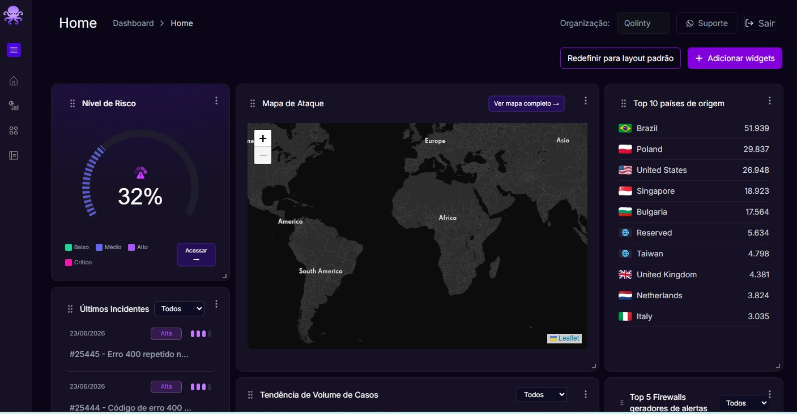
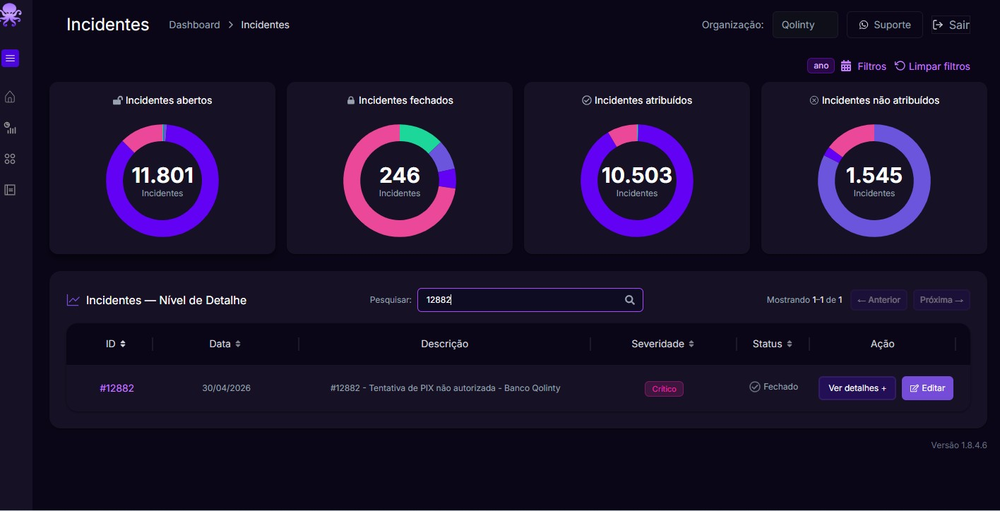
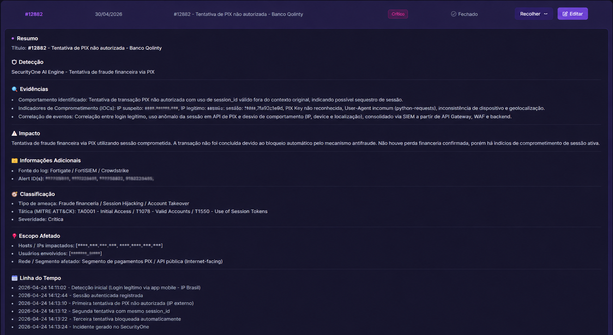

# 🛡️ Lab 01 - Investigação de Incidente utilizando Security One

## 🎯 Objetivo

Investigar um incidente utilizando uma plataforma Security Operations Center (SOC), identificando sua severidade, analisando evidências e compreendendo seu impacto.

---

## 🖥️ Ambiente

| Item | Valor |
|------|-------|
| Plataforma | Security One |
| Tipo | Ambiente de treinamento |
| Área | Security Operations Center (SOC) |

---

## 📖 Cenário

Neste laboratório foi realizada a investigação do incidente **#12882**, disponibilizado no ambiente de treinamento da plataforma Security One.

O objetivo foi compreender o fluxo inicial de investigação executado por um Analista SOC.

---

## 🔍 Passo 1 – Acessando o Dashboard

O Dashboard apresenta uma visão geral do ambiente, incluindo indicadores de risco, mapa de ataques, incidentes recentes e estatísticas de monitoramento.

**Figura 1 – Dashboard da plataforma**

---

## 🔍 Passo 2 – Localizando o incidente

Foi realizada a pesquisa pelo incidente **#12882**, identificado com severidade **Crítica** e status **Fechado**.

**Figura 2 – Pesquisa do incidente**

---

## 🔍 Passo 3 – Análise dos detalhes

Na tela de detalhes foi possível analisar:

- Resumo do incidente
- Evidências
- Impacto
- Classificação
- Escopo afetado
- Linha do tempo

**Figura 3 – Detalhes do incidente**

